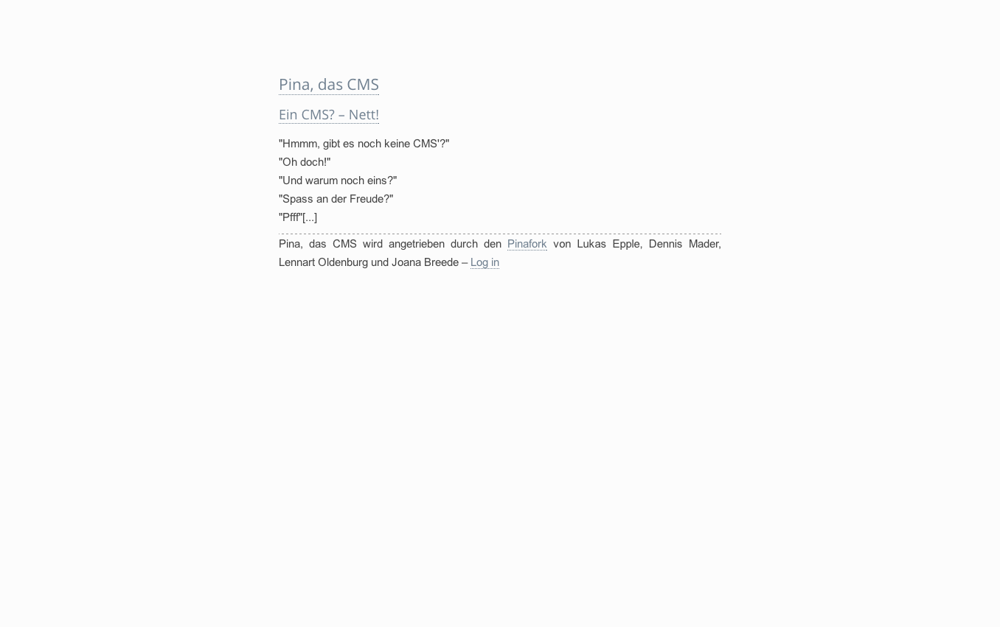
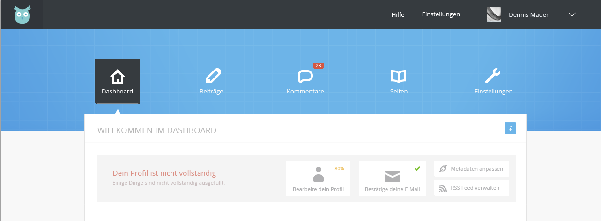

# Uggla, früher Pina
  
Uggla ist ein einfaches Bloggingsystem.  
Artikel können ohne viel Tamtam geschrieben und verwaltet werden, es gibt einen Artikel-RSS-Feed. Fürs Templating gibt es eine schöne und umfangreiche API, mit der sogar die Artikel verwaltet werden können!
# Die kommende Webseite
In den nächsten Tagen launchen wir eine Webseite, von der aus Uggla zum Download zur Verfügung stehen wird & Docs sowie Hilfe geliefert werden.

# Das neue Dashboard der zweiten Alpha

## Siehe auch
* [Probleme und Bugs](https://github.com/Weltraumakustik/Pina/issues)
* [Doku](https://github.com/Weltraumakustik/Pina/wiki)
* *[Testserver] (http://pina.weltraumakustik.de/)* ***Vorerst keine neuen Versionen***

## Gebaut von:
### Dennis
Skype: dennism1995  
Twitter: [@weltraumakustik](http://twitter.com/weltraumakustik)   
Webseite: [Weltraumakustik](http://weltraumakustik.de)

### Lukas
Skype: ruby_de  
Twitter: [@lukasepple](https://twitter.com/lukasepple)  
Webseite: <http://lukasepple.de>

### Bugfixes/ Verbesserungen/ Sicherheitskram: Lenny
Twitter: [@LennyCode](https://twitter.com/LennyCode)  
Webseite: [Vezoov](http://www.vezoov.com/)

## Lizenz
Wir veröffentlichen **Uggla** unter der [":) license"](http://licence.visualidiot.com/) und sagen [Visual idiot](https://github.com/idiot) 'Danke!'. 
Das Logo und andere Grafischelemente sind nicht teil der Lizenz & sind somit nicht ohne Erlaubnis zu verwenden.   
Das Copyright liegt bei Joana Breede & Dennis Mader.

Der Lizenztext lautet:  
By attaching this document to the given files (the “work”), you, the licensee, are hereby granted free usage in both personal and commerical environments, without any obligation of attribution or payment (monetary or otherwise). The licensee is free to use, copy, modify, publish, distribute, sublicence, and/or merchandise the work, subject to the licensee inflecting a positive message unto someone. This includes (but is not limited to): smiling, being nice, saying “thank you”, assisting other persons, or any similar actions percolating the given concept.
The above copyright notice serves as a permissions notice also, and may optionally be included in copies or portions of the work.
The work is provided “as is”, without warranty or support, express or implied. The author(s) are not liable for any damages, misuse, or other claim, whether from or as a consequence of usage of the given work.
